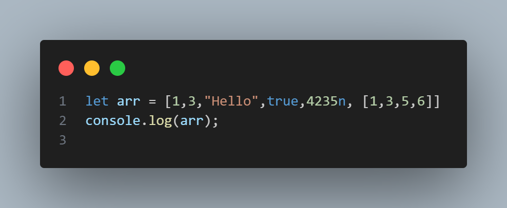
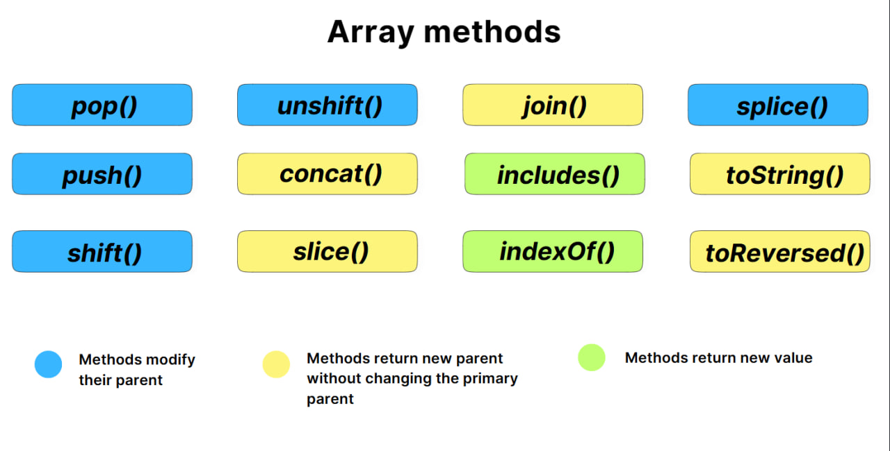

# arrays in js 


<div aligh="center" style="margin-top: 50px">

</div>

## Дар JavaScript, массив (Array) як объектест, ки барои нигоҳ доштани маҷмӯи маълумот истифода мешавад. Массивҳо имкон медиҳанд, ки як ё якчанд арзишҳо (элементҳо) дар як ҷои нигаҳдорӣ шаванд ва ба онҳо тавассути индекси онҳо дастрас шавед.


# Дар забони барномасозии JS массивҳо аз дигар забонҳои статики фарқ мекунад.

# Массив дар забони бврномасози С++
# Example

```cpp
#include <iostream>
using namespace std;

int main() {
    // Объявление и инициализация массива
    int numbers[5] = {10, 20, 30, 40, 50};

    // Вывод элементов массива
    cout << "Элементы массива: ";
    for (int i = 0; i < 5; i++) {
        cout << numbers[i] << " ";
    }
    cout << endl;

    // Изменение элемента массива
    numbers[2] = 99;
    cout << "Измененный массив: ";
    for (int i = 0; i < 5; i++) {
        cout << numbers[i] << " ";
    }
    cout << endl;

    return 0;
}
```

# Массив дар забони барномасозиис JS 
# Example

# Мисол чихел дар забони барномасозии C++ дидед дар массив фақат рақамро қабул кард барои ин ки мо типи  массивро муайян кардем дар забони JS бошад ин забон динамики мебошад ва аз он сабаб да массив мо бисер маълумотҳоро дохил карда метавонем мисли: number, string, bool-value: true or false, array, functions, many more.....

---

# Arrays methods 


# pop() 
## Методи pop() дар JavaScript барои ҳазфи охирин элемент аз массив ва баргардонидани арзиши он истифода мешавад. Ин метод андозаи массивро тағйир медиҳад.
```javascript
array.pop();
```
# Арзиши баргардондашуда: Элементи ҳазфшуда аз массив. Агар массив холӣ бошад, undefined бармегардонад.
Таъсир ба массив: Массиви аслӣ тағйир меёбад.
Мисолҳо:

```js
let mevaho = ["Себ", "Банан", "Гелос"];

console.log("Массиви аввала:", mevaho); // ["Себ", "Банан", "Гелос"]

let ohirinMeva = mevaho.pop();
console.log("Элементи ҳазфшуда:", ohirinMeva); // "Гелос"
console.log("Пас аз pop():", mevaho); // ["Себ", "Банан"]
```

# push()
#  Методи push() дар JavaScript барои илова кардани як ё якчанд элемент ба охири массив истифода мешавад. Ин метод андозаи массивро тағйир дода, дар охир шумораи умумии элементҳоро бармегардонад.
Мисол

```js
let mevaho = ["Себ", "Банан"];

console.log("Массиви аввала:", mevaho); // ["Себ", "Банан"]

let length = mevaho.push("Гелос");
console.log("Массив пас аз push():", mevaho); // ["Себ", "Банан", "Гелос"]
console.log("Шумораи умумии элементҳо:", length); // 3
```

# unshift()
# Методи unshift() дар JavaScript барои илова кардани як ё якчанд элемент ба аввали массив истифода мешавад. Ин метод массивро тағйир медиҳад ва шумораи умумии элементҳои массивро бармегардонад.

```js
let mevaho = ["Банан", "Гелос"];

console.log("Массиви аввала:", mevaho); // ["Банан", "Гелос"]

let length = mevaho.unshift("Себ");
console.log("Массив пас аз unshift():", mevaho); // ["Себ", "Банан", "Гелос"]
console.log("Шумораи умумии элементҳо:", length); // 3
```

# shift()
# Методи shift() дар JavaScript барои ҳазфи аввалин элемент аз массив истифода мешавад. Ин метод массивро тағйир медиҳад ва элементе, ки ҳазф шудааст, бармегардонад.

```js
let mevaho = ["Себ", "Банан", "Гелос"];

console.log("Массиви аввала:", mevaho); // ["Себ", "Банан", "Гелос"]

let firstFruit = mevaho.shift();
console.log("Элементи ҳазфшуда:", firstFruit); // "Себ"
console.log("Массив пас аз shift():", mevaho); // ["Банан", "Гелос"]
```

# Боз якчандтаи дигар методҳо ҳастанд ки аз string омадаанд.

<div aligh="center" style="margin-top: 50px">

</div>

# Бо ҳамин тамом ташакури зиёд 

<div aligh="center" style="margin-top: 50px">

</div>


# Барои маълумоти бештар гирифтан дар [линки](https://www.canva.com/design/DAGVjdrRLHo/5jLBtB4v8MVBmIuNDhfn_Q/view?utm_content=DAGVjdrRLHo&utm_campaign=designshare&utm_medium=link&utm_source=editor#5) зерин пахш кунед